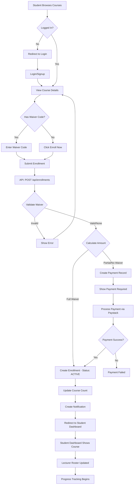
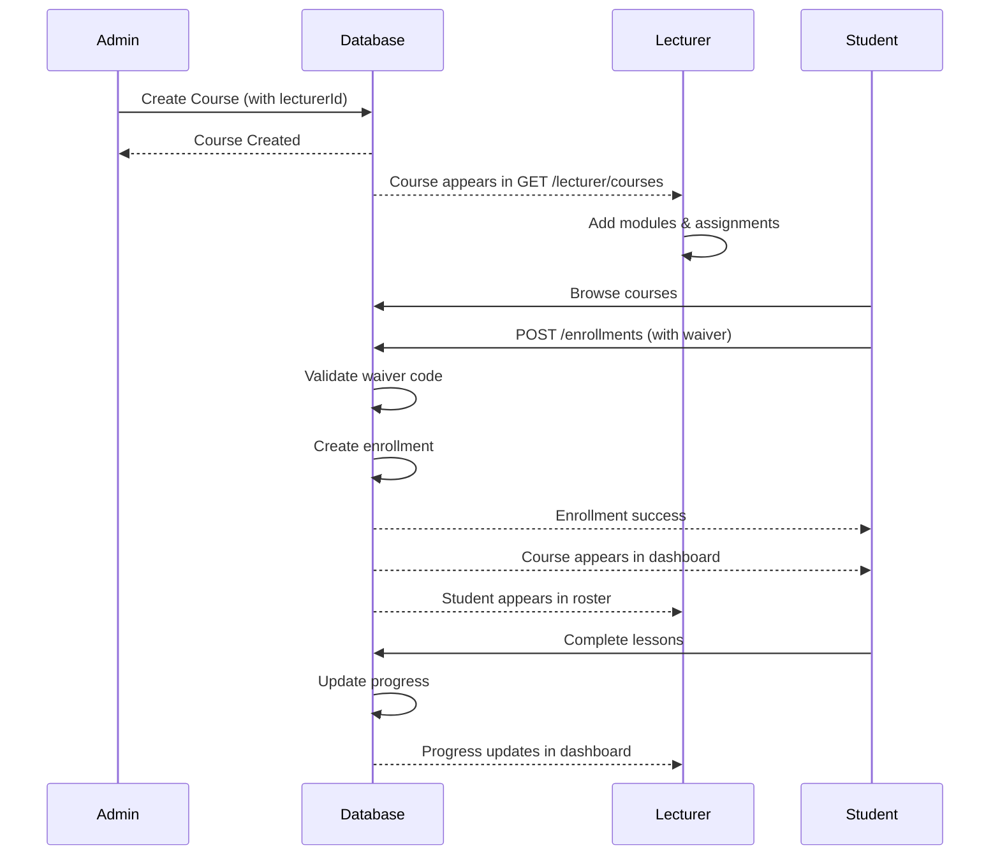

# CRADI LMS - Enrollment System Flow

## Complete Enrollment Journey



## Key API Endpoints

### 1. Enrollment Creation
**Endpoint:** `POST /api/enrollments`

**Request:**
```json
{
  "courseId": "course-123",
  "waiverCode": "SCHOLAR2025" // optional
}
```

**Response (Full Waiver):**
```json
{
  "success": true,
  "enrollment": {
    "id": "enroll-456",
    "userId": "user-789",
    "courseId": "course-123",
    "status": "ACTIVE",
    "progress": 0,
    "course": {
      "id": "course-123",
      "code": "CS 601",
      "title": "Machine Learning Fundamentals"
    }
  },
  "message": "Successfully enrolled in course"
}
```

**Response (Requires Payment):**
```json
{
  "success": true,
  "requiresPayment": true,
  "payment": {
    "id": "pay-123",
    "amount": 375000, // After discount
    "reference": "PAY-1234567890-abc123",
    "course": {
      "title": "Machine Learning Fundamentals",
      "code": "CS 601"
    }
  }
}
```

### 2. Student Enrollments
**Endpoint:** `GET /api/enrollments`

**Response:**
```json
{
  "enrollments": [
    {
      "id": "enroll-456",
      "courseId": "course-123",
      "status": "ACTIVE",
      "progress": 35,
      "enrolledAt": "2025-12-10",
      "calculatedProgress": 35,
      "totalLessons": 20,
      "completedLessons": 7,
      "course": {
        "id": "course-123",
        "code": "CS 601",
        "title": "Machine Learning Fundamentals",
        "lecturer": {
          "name": "Dr. Sarah Johnson"
        }
      }
    }
  ]
}
```

### 3. Lecturer Courses
**Endpoint:** `GET /api/lecturer/courses`

**Response:**
```json
{
  "courses": [
    {
      "id": "course-123",
      "code": "CS 601",
      "title": "Machine Learning Fundamentals",
      "students": 45,
      "modules": 8,
      "assignments": 12,
      "averageGrade": 85,
      "averageProgress": 67
    }
  ]
}
```

### 4. Course Roster
**Endpoint:** `GET /api/courses/[id]/students`

**Response:**
```json
{
  "students": [
    {
      "id": "user-789",
      "name": "Alice Johnson",
      "email": "alice@example.com",
      "studentId": "CRADI-2025-001",
      "progress": 85,
      "grade": 88,
      "completedLessons": 17,
      "totalLessons": 20
    }
  ]
}
```

## How the System Connects

### Admin → Lecturer → Student Flow



## Testing the Enrollment Flow

### Test Scenario 1: Full Waiver Enrollment
1. **Student** goes to `/courses/1`
2. Clicks "Have a waiver code?"
3. Enters `SCHOLAR2025`
4. Clicks "Enroll with Waiver"
5. **Result:** Instantly enrolled, redirected to dashboard

### Test Scenario 2: Partial Waiver
1. **Student** goes to `/courses/1`
2. Enters waiver code `EARLYBIRD50`
3. **Result:** Payment required for 50% of price

### Test Scenario 3: No Waiver
1. **Student** goes to `/courses/1`
2. Clicks "Enroll Now"
3. **Result:** Payment required for full price

### Test Scenario 4: Lecturer Views Roster
1. **Lecturer** logs in
2. Goes to `/lecturer/courses/1`
3. **Result:** Sees all enrolled students with progress

## Database Flow

**When student enrolls:**
1. Check existing enrollment
2. Validate course availability
3. Process waiver code (if provided)
4. Create Payment record
5. Create Enrollment record (if fully waived)
6. Update waiver usage count
7. Increment course enrollment count
8. Create success notification

**When lecturer views roster:**
1. Verify lecturer owns course
2. Fetch all active enrollments
3. Calculate progress for each student
4. Return enriched student data

## Required Waiver Codes (For Testing)

Add these to your database:
- `SCHOLAR2025` - 100% waiver (FULL_WAIVER)
- `EARLYBIRD50` - 50% discount (PERCENTAGE, value: 50)
- `ALUMNI25` - 25% discount (PERCENTAGE, value: 25)

## Next Steps

1. Update student dashboard to fetch real enrollments
2. Update lecturer roster to fetch real students
3. Test complete flow end-to-end
4. Add payment gateway integration
