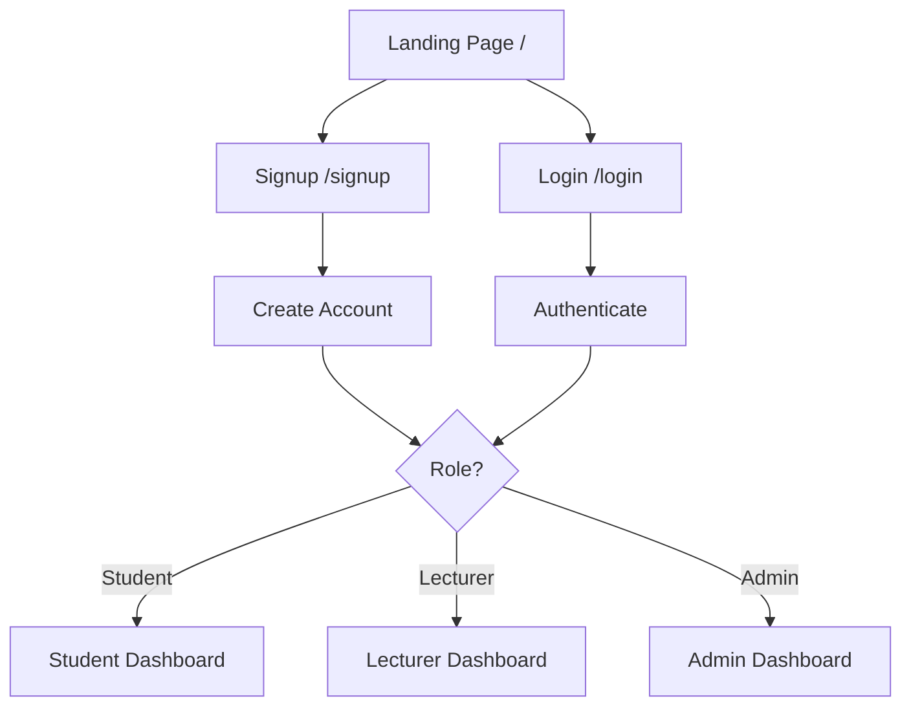
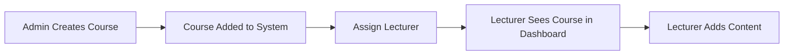
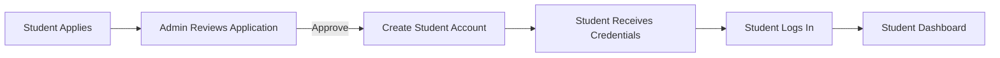
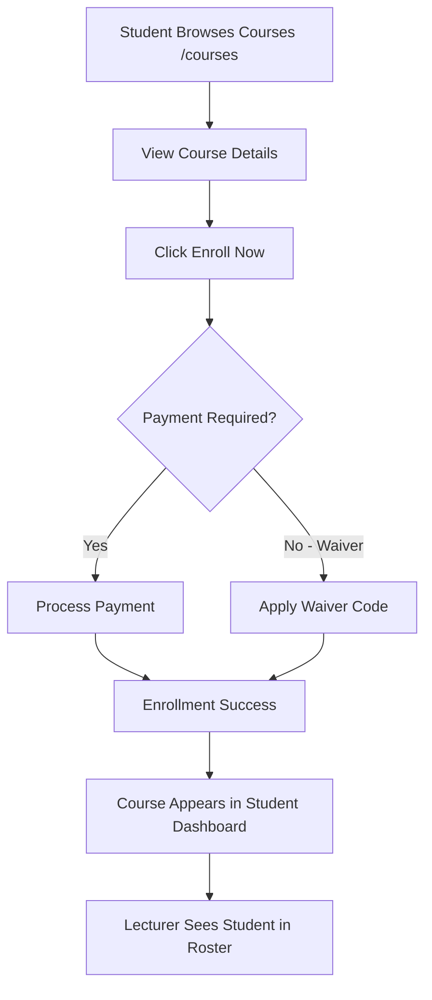
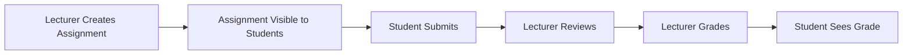

# CRADI LMS - System Architecture & Data Flow

## Current System Overview

### **Role-Based Access**

The system has three main user roles with separate dashboards:

1. **Admin** - `/admin/dashboard`
   - System-wide management
   - User management
   - Course administration
   - Application review
   
2. **Lecturer** - `/lecturer/dashboard`
   - Course content creation
   - Student grading
   - Assignment management
   
3. **Student** - `/student/dashboard`
   - Course enrollment
   - Assignment submission
   - Progress tracking

---

## Authentication Flow



### **Current Implementation:**

1. **Signup** → User selects role (Student/Lecturer/Admin)
2. **Login** → System checks role → Redirects to appropriate dashboard
3. **localStorage** stores:
   - `token` - JWT authentication token
   - `user` - User data (name, email, role, studentId, etc.)

---

## Data Flow & Connections

### **1. Admin → Course Creation → Lecturer Assignment**

**Current State:** ❌ Not connected
**Should Be:**



**Missing Links:**
- Admin can create courses, but they're not assigned to lecturers
- Lecturers see mock courses, not real admin-created ones

---

### **2. Admin → Application Review → Student Enrollment**

**Current State:** ❌ Partially connected
**Should Be:**



**Current Implementation:**
- ✅ Admin can approve/reject applications (shows alert)
- ❌ Approval doesn't create actual student account
- ❌ No email notification system

---

### **3. Course Enrollment Flow**

**Should Be:**



**Current State:** ❌ Not fully connected
- ✅ Students can browse courses
- ✅ Course detail page has "Enroll Now" button
- ❌ Enrollment doesn't persist to database
- ❌ Enrolled courses don't show in student dashboard
- ❌ Students don't appear in lecturer's roster

---

### **4. Assignment Lifecycle**

**Should Be:**



**Current State:** ❌ Not connected
- ✅ Lecturer can create assignments (shows alert)
- ❌ Assignments don't persist
- ❌ Students can't see assignments
- ❌ No submission flow

---

## What's Working (Frontend Only)

### ✅ **Fully Functional UI:**
- All dashboard layouts
- Navigation between pages
- Form validation
- User profile management (localStorage)
- Mock data display

### ✅ **Authentication:**
- Signup with role selection
- Login with role-based routing
- Logout functionality
- JWT token generation (backend)

### ✅ **Role-Based Pages:**
- **Admin:** Users, Courses, Applications, Waiver Codes, Reports, Settings, Calendar
- **Lecturer:** Course Management, Modules, Grading, Analytics, Announcements, Sessions
- **Student:** Profile, Course Browse, Certificates, Transcript

---

## What's Missing (Backend Connections)

### ❌ **Database Integration:**
1. **Courses** - Admin-created courses not in database
2. **Enrollments** - Student enrollments not persisted
3. **Assignments** - Created assignments not saved
4. **Submissions** - Student submissions not stored
5. **Grades** - Grading not persisted

### ❌ **Real-Time Data Flow:**
1. Admin actions don't affect lecturer/student views
2. Lecturer actions don't affect student views
3. No data synchronization between roles

### ❌ **API Endpoints Needed:**
- `POST /api/courses` - Create course
- `POST /api/enrollments` - Enroll student
- `POST /api/assignments` - Create assignment
- `POST /api/submissions` - Submit assignment
- `POST /api/grades` - Grade submission
- `GET /api/lecturer/courses` - Get lecturer's assigned courses
- `GET /api/student/enrollments` - Get student's enrolled courses

---

## Recommended Implementation Order

### **Phase 1: Course Management** 🔵
1. Create course creation API
2. Link admin-created courses to database
3. Assign courses to lecturers
4. Display real courses in lecturer dashboard

### **Phase 2: Enrollment System** 🟢
1. Create enrollment API
2. Implement payment/waiver flow
3. Update student dashboard with enrolled courses
4. Update lecturer roster with enrolled students

### **Phase 3: Assignment & Grading** 🟡
1. Create assignment CRUD APIs
2. Implement submission system
3. Build grading interface
4. Display grades to students

### **Phase 4: Application Review** 🟠
1. Create application submission form
2. Link admin approval to account creation
3. Send email notifications
4. Auto-enroll approved students

---

## Quick Fixes to Improve Flow

### **1. Link Course Browse to Enrollment**
Currently: Students can browse but enrollment doesn't persist
**Fix:** Connect `/courses/[id]` enrollment to backend API

### **2. Connect Lecturer Courses to Real Data**
Currently: Lecturers see mock courses
**Fix:** Fetch courses assigned by admin from database

### **3. Student Dashboard Shows Enrolled Courses**
Currently: Shows mock enrolled courses
**Fix:** Fetch real enrollments from database

### **4. Admin Actions Update Other Dashboards**
Currently: Admin approvals/creations are isolated
**Fix:** Create WebSocket or polling for real-time updates

---

## Data Structure Example

```typescript
// How data should flow between roles

// ADMIN creates course
Course {
  id: "course-123",
  code: "CS 601",
  title: "Machine Learning",
  lecturerId: "lecturer-456", // Assigned lecturer
  price: 750000,
  status: "Active"
}

// LECTURER sees assigned courses
GET /api/lecturer/courses
→ Returns courses where lecturerId = current user

// STUDENT enrolls
Enrollment {
  id: "enroll-789",
  studentId: "student-012",
  courseId: "course-123",
  status: "Active",
  enrolledAt: "2025-12-12"
}

// LECTURER sees enrolled students
GET /api/courses/course-123/students
→ Returns all enrollments for this course
```

---

## Summary

**Current State:**
- ✅ Beautiful, functional UI for all roles
- ✅ Complete frontend pages and forms
- ✅ Role-based authentication
- ❌ No data persistence beyond localStorage
- ❌ Roles are isolated (no data sharing)

**To Fully Connect:**
1. Implement backend APIs for CRUD operations
2. Replace mock data with real database queries
3. Create enrollment and assignment workflows
4. Add real-time data synchronization

The frontend is 100% ready - we just need to connect it to proper backend APIs! 🚀
